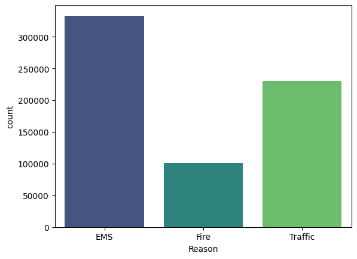
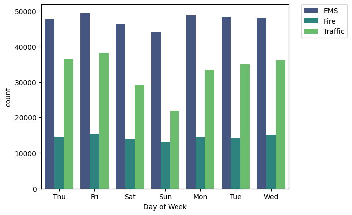
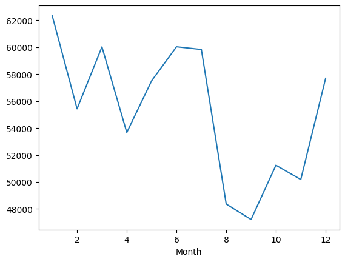
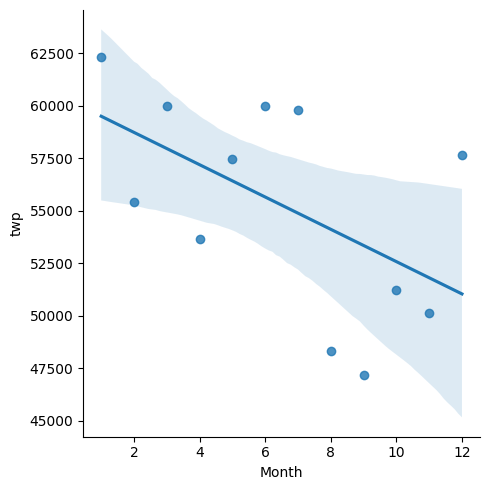
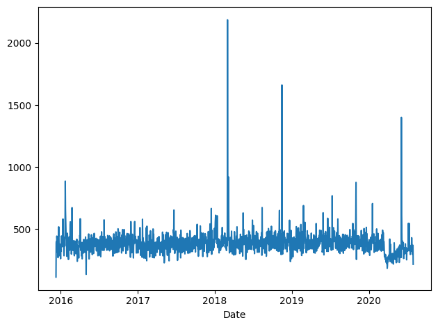
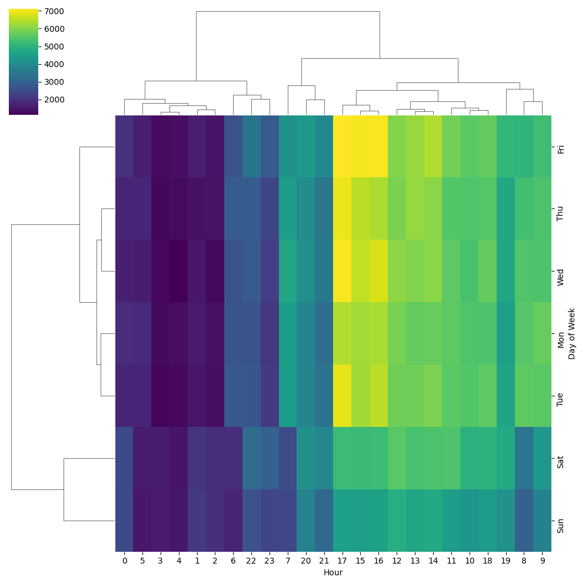

# EDA-using-Python-Insights-From-911-Calls


# 📊 Data Exploration: Insights From 911 Calls using Python

When I started learning data analysis in Python, I wanted to try a real-world dataset — something that actually matters. That’s when I found this dataset about 911 emergency calls from Montgomery County, Pennsylvania on Kaggle. It contains every call with details like the location, type of emergency, and timestamp.

My goal in this project was simple:

➡️ Understand why people call 911 the most
➡️ Find when emergencies happen more often — by hour, day, and month
➡️ Visualize the patterns clearly using Python tools

To get started, I used Pandas for handling the data, and Matplotlib + Seaborn for visualizing it.

```python
import numpy as np
import pandas as pd
import matplotlib.pyplot as plt
import seaborn as sns
%matplotlib inline
```

After setting up, I loaded the CSV file:

```python
df = pd.read_csv('911.csv')
df.info()
df.head()
```

That’s when I noticed something immediately:

The **timeStamp** column — which clearly includes date and time — was stored as plain text. That means I couldn’t directly extract hours or weekdays yet. So, that became an important part of the journey.


---

## 🆘 What are people calling 911 for?

One column called **title** grabbed my attention. It looked like this:

```
EMS: BACK PAINS/INJURY  
Traffic: VEHICLE ACCIDENT  
Fire: GAS-ODOR/LEAK
```

Before the colon is the main category. I realized I could extract that into a new column called **Reason**.

```python
df['Reason'] = df['title'].apply(lambda x: x.split(':')[0])
```

And just like that, the data became way more readable.

```python
sns.countplot(x='Reason', data=df)
plt.title("Count of 911 Calls by Reason")
```

📌 Most 911 calls are **EMS (medical emergencies)**
📌 Traffic and Fire follow behind




Already, the data had a story:

> Health emergencies are the biggest reason people dial 911.

---

## ⏱ Turning timestamps into actual time insights

```python
df['timeStamp'] = pd.to_datetime(df['timeStamp'])
```

Then I pulled out useful details:

```python
df['Hour'] = df['timeStamp'].apply(lambda x: x.hour)
df['Month'] = df['timeStamp'].apply(lambda x: x.month)
df['DayOfWeek'] = df['timeStamp'].apply(lambda x: x.dayofweek)
```

To make weekdays more readable:

```python
dmap = {0:'Mon', 1:'Tue', 2:'Wed', 3:'Thu', 4:'Fri', 5:'Sat', 6:'Sun'}
df['DayOfWeek'] = df['DayOfWeek'].map(dmap)
```

👉 Do emergencies care about weekends?

```python
sns.countplot(x='DayOfWeek', data=df, hue='Reason')
plt.legend(bbox_to_anchor=(1.25,1))
```

📌 Weekdays are more active than weekends — especially for EMS & Traffic calls.



---

## 📆 Do emergencies have a season?

```python
by_month = df.groupby('Month').count()
by_month['lat'].plot()
plt.title("Total 911 Calls per Month")
```

📌 Calls dip in late summer months — likely fewer incidents and illnesses?



Trend line:

```python
sns.lmplot(x='Month', y='twp', data=by_month.reset_index())
```



---

## 🔍 Zooming in: Calls per day

```python
df['Date'] = df['timeStamp'].apply(lambda x: x.date())
```

```python
df.groupby('Date').count()['lat'].plot()
plt.title('911 Calls per Day')
```

Some days spike sharply — probably weather or major accidents — but overall it fluctuates constantly.

Traffic-specific trends:

```python
df[df['Reason']=="Traffic"].groupby('Date').count()['lat'].plot()
plt.title("Traffic Calls per Day")
```



---

## 🔥 Heatmaps — my favorite discovery!

```python
day_hour = df.groupby(['DayOfWeek','Hour']).count()['Reason'].unstack()
sns.heatmap(day_hour, cmap='viridis')
plt.title("911 Calls by Day & Hour")
```

📌 Key insights:

| Time            | Pattern                    |
| --------------- | -------------------------- |
| Midnight – 5 AM | Very few calls             |
| Day + Evening   | Major emergency peak       |
| Weekends        | Quiet compared to weekdays |

Cluster map:

```python
sns.clustermap(day_hour, cmap='viridis')
```



---

This project made me realize how much a simple dataset can reveal when you clean it, explore it, and let it speak visually. I’m excited to continue improving my data skills and take on bigger challenges next!

---

